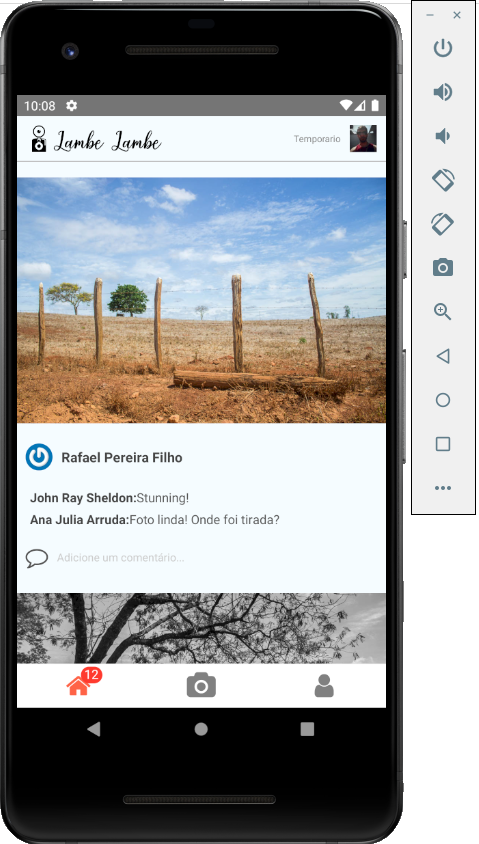
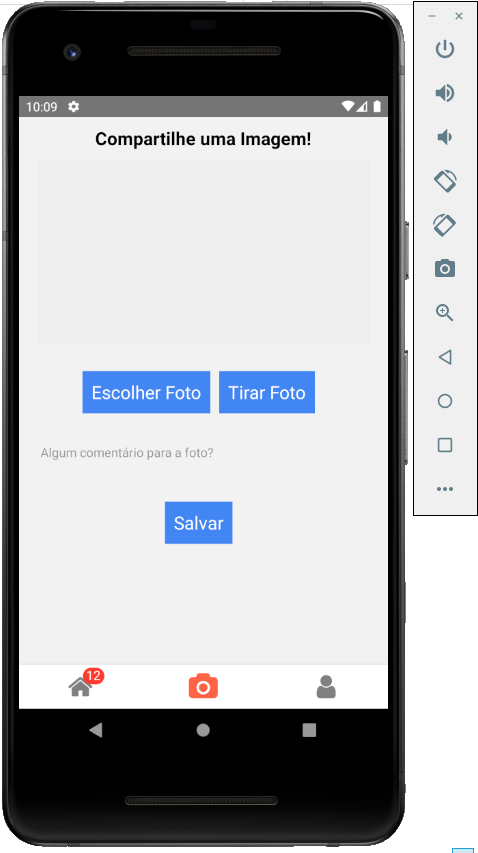
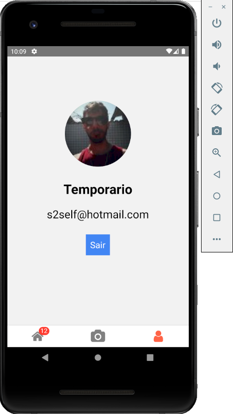
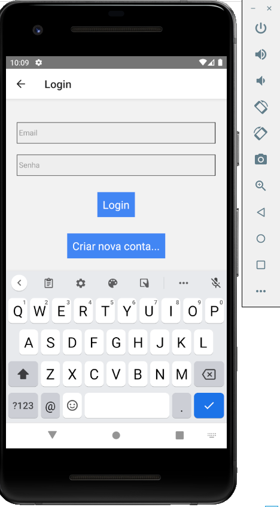

# Projeto React Native

# Objetivo

Desenvolver uma aplicação de clone do Instagram funcional tanto pra Android quanto IOS.  
Interface agradável e intuitiva ao usuário e diversos recursos foram explorados!  
Aqui vale uma ressalva, o projeto original do curso foi desenvolvido em 2019,  
muita coisa mudou o comportamento e a forma de implantar, então eu precisei adaptar várias coisas  
para que o projeto continuasse funcional!  
Nessa versão não tem a integração com o backend, apenas dados mockados, pois no curso o professor utiliza  
o firebase como banco de dados. Na época do curso, a api functions do firebase era gratuita e hoje não é mais,  
fazendo assim com que a integração não seja possível da mesma forma que foi passada no curso!

# Tecnologias

Para desenvolver o projeto foram utilizados:
- JavaScript
- React Native
- Redux
- Middlewares (Redux Thunk)

Algumas dependências legais utilizadas:
- React Native Gravatar
- React Native Image Picker
- React Native Vector Icons
- React Native Screens
- React Native Navigator
- React-Redux pra integrar o gerenciamento de estado
- Axios pra requisições no backend

# Layout

 
 

# Clone

Caso queira verificar o aplicativo rodando em sua máquina,  
basta clonar o repositório e através do terminal acessar a pasta clonada.  
Como não faz sentido subir a pasta node_modules pro git, você irá perceber que a mesma está faltando.  
Para resolver, muito simples, basta executar o comando "npm i" que todas as dependências necessárias  
serão lidas no package.json e baixadas em sua máquina. Depois basta executar o projeto normalmente.

# Créditos

Os códigos são de autoria do professor Leonardo Moura Leitao (https://github.com/leonardomleitao)  
E foram reproduzidos por Fernando Piattelli no decorrer do curso.
