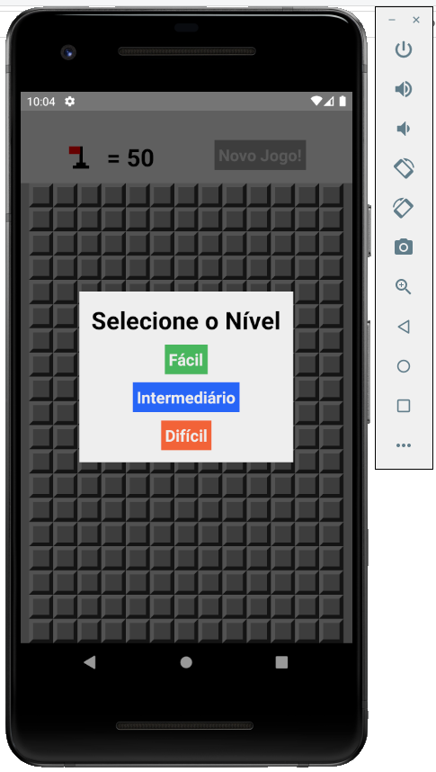
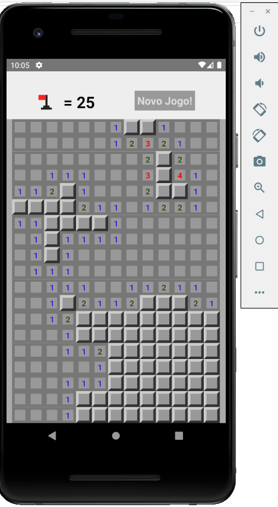

# Projeto React Native

# Objetivo

Desenvolver uma aplicação do game Campo Minado funcional tanto em Android quanto IOS.  
Nesse projetos foram abordados diversas técnicas e lógicas mais complexas também!  
Foram implementados três níveis de dificuldades: fácil, intermediário e avançado.  
Foi trabalhado conceitos de modal também.

# Tecnologias

Para desenvolvedor o projeto foram utilizados:
- JavaScript
- React Native

# Layout

 

# Clone

Caso queira verificar o aplicativo rodando em sua máquina,  
basta clonar o repositório e através do terminal acessar a pasta clonada.  
Como não faz sentido subir a pasta node_modules pro git, você irá perceber que a mesma está faltando.  
Para resolver, muito simples, basta executar o comando "npm i" que todas as dependências necessárias  
serão lidas no package.json e baixadas em sua máquina. Depois basta executar o projeto normalmente.

# Créditos

Os códigos são de autoria do professor Leonardo Moura Leitao (https://github.com/leonardomleitao)  
E foram reproduzidos por Fernando Piattelli no decorrer do curso.
